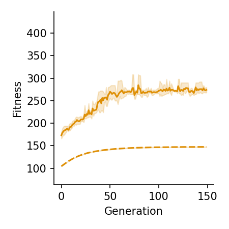
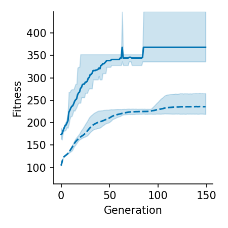
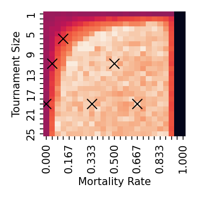
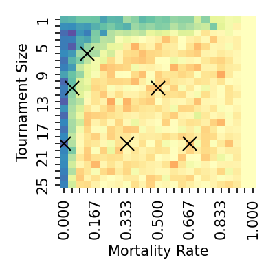
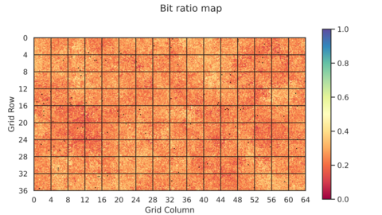

# Supplementary Information

This file is an overview of the results presented in *Ramps and Ratchets: Evolving Spatial Viability Landscapes*, a paper for [ALife 2025](https://www.alife-japan.org/alife-2025), including additional figures that could not fit in the original paper.

***This is a work in progress! The figures here are correct, but the styling and formatting needs work, as do the explanations for what these images mean. Many improvements coming soon.***

## Introduction

This experiment evolves bit strings to solve a fitness function named HIFF, but it does so within a 2D spatial environment, where each location has a minimum fitness score needed to survive and reproduce (a "viability threshold"), which changes gradually. This is able to induce the selection pressure needed for the bit strings to evolve. We experiment with hand-designed environments, but also with environments we evolved using CPPNs.

Figure 1: In this experiment, individuals move through a spatial environment with varying thresholds for survival. (a) With a low threshold, individuals explore phenotype space. (b) A gradual ramp up allows a relatively fit individual to migrate to an empty deme, exploiting its genetic innovation by spawning many offspring. (c) Exploration resumes, but more mutations are fatal here. This creates a ratchet effect where fitness in this deme can increase, but cannot drop be- low the threshold, driving local mean fitness up. (d) The process repeats at the next higher viability threshold.

## Hyperparameters

All results from the paper and in this file were generated using the following hyperparameters, unless otherwise stated:

| Hyperparameter | Value | Description |
|---|:---:|:---|
| `tournament_size` | 6 | How many individuals are considered when doing selection. This determines how much selection depends on fitness. 1 means individuals are chosen at random, while 25 means only the most fit individual is chosen.|
| `mortality_rate` | 0.125 | How likely are individuals to be eliminated at ranom each generation. This determines how often selection acts on the population. |
| `migration_rate` | 1.0 | How far away an individual's offspring can be. This is a multiplier for a gaussian distribution centered on the current location, used to determine the location of each offspring.|
| `fertility_rate` | 25 | The maximum number of offspring each individual can have each generation.|
| `replications` | 5 | The number of times each experiment is run, to account for the natural variability in this experiment.|
| `mutation_rate` | 0.015625 | How likely each bit in a genotype is to flip in each generation. This number is 2-6, since that is convenient to implement.|
| `environment_shape` | 64x36 demes | The shape of the 2D space where simulations happen. Each deme has a population of bit strings, which occasionally move according to `migration_rate`.|
| `carrying_capacity` | 25 per deme | How many individuals are in each of the isolated sub-populations.|
| `cppn_population_size` | 30 | How many CPPNs we maintain in our population in order to evolve environments.|
| `inner_generations` | 150 | How many generations we evolve the bit strings for. |
| `outer_generation` | 20 | How many generations we evolve the CPPNs / environments for. |
| `bit_string_length` | 64 | How long each bit string is. |

Note that we ran a hyperparameter sweep over 25x25 different settings for `tournament_size` and `mortality_rate`, as well as for `migration_rate` and `fertility_rate`. The other parameters were chosen by intuition, trial, and error.

## Simulations

We evolved bit strings using the default hyperparameters in two hand-designed environments, and in an environment evolved to produce high fitness scores with those hyperparameter settings. These results represent the best of five replications.
 
| Environment Name | Environment Design | Simulated Evolution |
|---|---|---|
| flat |  | |
| baym |  | |
| cppn |  | |

These charts summarize the evolutionary trajectory of the bit string populations evolving in these three settings. The solid (dashed) lines represent the max (mean) fitness of the population, with the shade region indicating the full range of values across five replications.

|flat|baym|cppn|
|:---:|:---:|:---:|
| | ||

## Sample CPPNs

When evolving environments, we saw a wide variety of designs:

## Breaking the ramp

Our experiment showed that an accessible ramp-up in difficulty is important for inducing selection pressure. To illustrate the necessary and sufficient conditions for this effect, we demonstrate several ways to break it.

Changing the gradual ramp-up of the baym environment prevents bit strings from migrating to the center:

| | Intermediate steps removed | Lower steps removed |
| --- | :---: | :---: |
| Environment |  | |
| Final population |   ||

Changing the hyperparameter values:
| | Low `fertility_rate` | Low `migration_rate` |
| --- | :---: | :---: |
| Final population |  | |

## Hyperparameter sweep

We did a hyperparameter sweep over `tournament_size` and `mortality_rate` which are the primary determiners of selection pressure.

| | flat | baym | cppn |
| --- | :---: | :---: | :---: |
| Absolute |  |  |  |
| Relative | |  baym vs. flat |    cppn vs. both|

A histogram of fitness values across the hyperparameter sweep:

`tournament_size = 0.000, mortality_rate = 19`

`tournament_size = 0.042, mortality_rate = 11`

`tournament_size = 0.125, mortality_rate = 6`

`tournament_size = 0.333, mortality_rate = 19`

`tournament_size = 0.500, mortality_rate = 11`

`tournament_size = 0.667, mortality_rate = 19`

## Multi-Objective Optimization

We attempted to evolve environments that could reshape how the HIFF function gets evaluated and bias the solutions to have different mixes of 0 and 1 bits, as well as getting a high score. The results were hard to interpret, but it seems clear that this was doing something interesting:

| Condition | Trial 1 | Trial 2 | Trial 3 | Trial 4 | Trial 5 |
| --- | --- | --- | --- | --- | --- |
| No preference |  |  |  |  | 
| Prefer bit strings with more 0's and ones with more 1's |  |  |  |  | 
| Prefer bit strings with a mix of 0's and 1's |  |  |  |  | 
| Prefer all bit strings to have more 0's or more 1's |  |  |  |  | 
