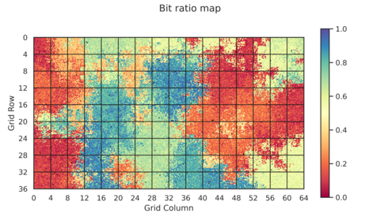

# Supplementary Information

This file is an overview of the results presented in *Ramps and Ratchets: Evolving Spatial Viability Landscapes*, a paper for [ALife 2025](https://www.alife-japan.org/alife-2025), including additional figures that could not fit in the original paper.

## Introduction

This experiment evolves bit strings to solve a fitness function named HIFF, but it does so within a 2D spatial environment, where each location has a minimum fitness score needed to survive and reproduce (a "viability threshold"), which changes gradually across space. Our experiment suggests this setup can induce the selection pressure needed for the bit strings to evolve, without having to explicitly choose to propagate the more fit individuals. We experiment with hand-designed environments that can generate this effect, but also with environments we evolved using CPPNs.

![A diagram visualizing a population of bit strings as circles. The vertical axis of this diagram indcates fitness, with both the circle's placement and color indicating its fitness score. The horizontal dimension is space, showing three distinct regions with gradually increasing viability thresholds, which are shown as bars of increasing hight. Circles below these bars are X'ed out, indicating they are not viable and do not reproduce. The remaining circles have a range of fitness scores, but where the viability threshold is higher, the average fitness of the population there increases, as the range of fitness values decreases.](figures/figure1.png)

Figure 1: In this experiment, individuals move through a spatial environment with varying thresholds for survival. (a) With a low threshold, individuals explore phenotype space. (b) A gradual ramp up allows a relatively fit individual to migrate to an empty deme, exploiting its genetic innovation by spawning many offspring. (c) Exploration resumes, but more mutations are fatal here. This creates a ratchet effect where fitness in this deme can increase, but cannot drop be- low the threshold, driving local mean fitness up. (d) The process repeats at the next higher viability threshold.

## Hyperparameters

This experiment uses a number of hyperparameters, which we document in the table below. Some were chosen by intuition or by trial and error, while others we explored systematically with hyperparameter sweeps (indicated with a \*). All results from the paper and in this file were generated using the following settings, unless otherwise stated:

| Hyperparameter | Value | Description |
|---|:---:|:---|
| `tournament_size`* | 6 | Each time we select an individual to propagate, randomly pick this many and take the best one. This determines how much relative fitness influences the population in the next generation. 1 means individuals are chosen at random, while 25 means only the most fit individual is chosen.|
| `mortality_rate`* | 0.125 | This algorithm primarily works by eliminating unfit individuals. However, we also eliminate individuals at random at this rate every generation. This frees up carrying capacity to be filled with selected individuals, and changing how often selection acts on the population. |
| `migration_rate`* | 1.0 | In each generation, we fill unused carrying capacity by selecting nearby individuals to have extra offspring. We randomly pick these from a location determined by a standard normal distribution, centered on the current location and scaled by this factor. When this parameter is low, individuals always spawn into their current location; when it is high, they may come from one or two spaces away.|
| `fertility_rate`* | 25 | By default, each individual replaces itself, but when additional carrying capacity is available, we try to fill it with extra offspring from selected individuals. This parameter is the maximum number of offspring each individual can have each generation, which affects how quickly a migrating bit string can fill a new location with its offspring. |
| `num_trials` | 5 | This is a stochastic algorithm, and the results depend significantly on precisely when and where mutations occur. To account for this and estimate average behavior, we run this many replications of each experiment. |
| `mutation_magnitude` | 6 | How likely each bit in a genotype is to flip in each generation. For convenience, we chose a mutation rate that is a power of two (in this case, 2-6) since that is easy to implement using bitwise arithmetic. This is equivalent to a mutation rate of 0.015625.|
| `env_shape` | 64x36 demes | The shape of the 2D space where simulations happen. This defines a rectangular grid of demes, each of which has a viability threshold and a population of bit strings, which occasionally migrate to nearby locations.|
| `carrying_capacity` | 25 per deme | The maximum number of bit strings allowed in each deme. Initially, all demes are filled with this many random individuals, but in each generation we eliminate bitstrings, and then propagate those that remain, causing the number of living bit strings to shift.|
| `env_pop_size` | 30 | How many CPPNs we maintain in our population in order to evolve environments.|
| `bitstr_generations` | 150 | How many generations we evolve the bit strings for. |
| `env_generations` | 20 | How many generations we evolve the CPPN environments for. |
| `bitstr_len` | 64 | How long each bit string is. This value was chosen for being the largest bit string that can be represented by a single integer on available hardware. |

\* We ran a hyperparameter sweep over 25x25 different combinations of settings for `tournament_size` and `mortality_rate`, as well as for `migration_rate` and `fertility_rate`.

## Simulations

We evolved bit strings using the default hyperparameters in two hand-designed environments, and in an environment evolved to produce high fitness scores with those hyperparameter settings. These results represent the best of five replications.

Below, we see visualizations of all three environments (left), with the coloration indicating the viability threshold at each location, ranging from black (all can survive) to white (only perfect scores can survive). On the right, we see videos of bit string populations evolved in each of these environments, with coloration indicating the fitness of each individual, ranging from black (dead) to deep purple (minimum score for HIFF, in this case 64) to white (maximum score for HIFF).
 
| Environment Name | Environment Design | Simulated Evolution |
|---|---|---|
| flat |  | |
| baym |  | |
| cppn |  | |

These charts summarize the evolutionary trajectory of the bit string populations evolved in these three settings. The solid (dashed) lines represent the max (mean) fitness of the population, with the shaded region indicating the full range of values across five replications.

|flat|baym|cppn|
|:---:|:---:|:---:|
| | ||

## Sample CPPNs

In this experiment, we used CPPNs to evolve the design for many environments. We genereated `num_trials` environments for each of the 1,250 hyperparameter settings we tested in the two sweeps, but only captured and visualized them at a few sample points in each sweep where the relationship between the fitness scores of the three environments seemed interesting. Below is a cherry-picked collection of these sampled environments, showing the range of designs we saw with different hyperparameter settings and random replications.

## Breaking the ramp

Our experiment showed that an accessible ramp-up in difficulty is important for inducing selection pressure. To illustrate the necessary and sufficient conditions for this effect, we found several ways to break it.

We can modify the step-wise gradient of the baym environment by removing some of the steps. On the left, we see what happens when the intermediate steps are removed, and on the right when the lowest steps are removed.

| | Intermediate steps removed | Lower steps removed |
| --- | :---: | :---: |
| Environment |  | |
| Final population |   ||

We can also leave the environment untouched, but break the ramp by changing the fertility rate that determine how quickly bit strings may fill new territory. When `fertility_rate` is low (3), we see bit strings can migrate toward the middle region. However, the populations quickly become more sparse, as fewer individuals can survive there, and they struggle to produce enough offspring to establish a stable population. When `migration_rate` is low (0.125), bit strings populate the lowest step and partially fill the next step up. This is the only time in the experiment where individual demes are visible (here rendered as 5x5 blocks of contiguous pixels), since bit strings rarely reach new demes, but quickly fill them with offspring when they do.

| | Low `fertility_rate` | Low `migration_rate` |
| --- | :---: | :---: |
| Final population |  | |

## Hyperparameter sweep

In this experiment, we found that the benefit of having an environment with a viability gradient is highly contingent on the explicit selection pressure imposed by our algoirthm. To explore this rigorously, we did a sweep across 25x25 settings for two hyperparameters. The `mortality_rate` determines how *often* selection acts on the population, and the `tournament_size` determines how much relative fitness of individuals factors into the population in the next generation.

Below are heatmaps, indicating environmental fitness across hyperparameter settings, colored using the same scale used for bit string fitness, ranging from black (dead), to deep purple (min hiff score), to white (max hiff score). X's indicate sample points where we recoreded full logs and the evolved environments (see below). Notice that for all environments, a `mortality_rate` greater than about 95% reliably led to complete extinction, indicated by the black bands on the right of each of the heat maps.

Below this we also have heatmaps comparing the fitness scores across environments. The "baym vs. flat" image was made by subtracting the flat heatmap from the baym one. Red indicates where the baym environment had lower scores, yellow indicates a tie, and blue indicates baym got a higher score. The "cppn vs. both" image was made by taking the element-wise maximum of the baym and flat heat maps and subtracting this from the cppn heatmap. Red indicates where the cppn environment had lower scores than the best of the other two, yellow indicates a tie, and blue indicates where cppn got a higher score.

| | flat | baym | cppn |
| --- | :---: | :---: | :---: |
| Absolute |  |  |  |
| Relative | |  baym vs. flat |    cppn vs. both|

Another way to visualize the hyperparemeter sweep is with a histogram. Here, we divide fitness into 14 bins, and count up how many times each environment achieved a fitness score in that range across the full hyperparameter sweep. Each pixel in the heatmaps above corresponds to one sample in the histogram. We see that the evolved environment (cyan) got high scores (>352) more often, the flat environment (orange) got low scores (<320) more often, and the baym environment (blue) got moderate scores (320-352) more often. The 0 scores for each environment correspond to where `mortality_rate` was too high for survival.

## Variation in evolved environments.

We found that in regions of hyperparameter space where the baym environment outperformed the flat environment, the evolved cppn environment tended to have complex structure and clear viability gradients. Where flat outperformed baym, the evolved cppn environments tended to be more flat with little or no viability gradient.

|||||
| :--- | :---: | :---: | :---: |
| Where baym beats flat | `tournament_size = 0.000, mortality_rate = 19`  |  `tournament_size = 0.042, mortality_rate = 11`  | `tournament_size = 0.125, mortality_rate = 6` |
| Where flat beats baym |`tournament_size = 0.333, mortality_rate = 19`  | `tournament_size = 0.500, mortality_rate = 11`  | `tournament_size = 0.667, mortality_rate = 19` |

## Multi-Objective Optimization

We speculate that variations of this algorithm could be valuable for solving multi-objective optimization problems, but only after building an experiment built around HIFF, which is not a great fit for assessing this. We attempted to evolve environments that could reshape how the HIFF function gets evaluated and bias the solutions to have different mixes of 0 and 1 bits, as well as getting a high score. The results were hard to interpret, but suggestive of what we might accomplish in the future. In these pictures, color indicates the balance between 0's and 1's. Red indicates more 0's, blue more 1's and yellow an even mix of 0 and 1 bits.

| Condition | Trial 1 | Trial 2 | Trial 3 | Trial 4 | Trial 5 |
| --- | --- | --- | --- | --- | --- |
| No preference |  |  |  |  | 
| Prefer bit strings with more 0's and ones with more 1's |  |  |  |  | 
| Prefer bit strings with a mix of 0's and 1's |  |  |  |  | 
| Prefer all bit strings to have more 0's or more 1's |  |  |  |  | 
